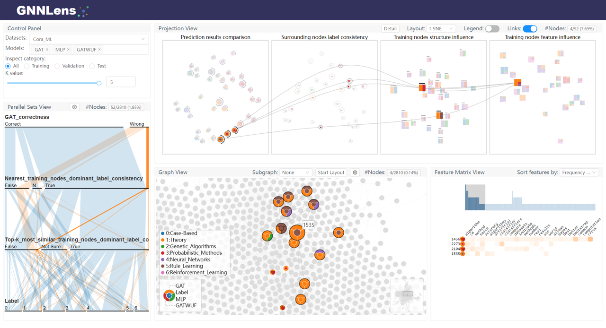

# GNNLens

This is the code repository for the paper "GNNLens: A Visual Analytics Approach for Prediction Error Diagnosis of Graph Neural Networks". GNNLens is a visual analysis tool to assist model developers and users in understanding and analyzing GNNs.

The paper is available at arXiv: [https://arxiv.org/abs/2011.11048](https://arxiv.org/abs/2011.11048).

The demo is available at: [https://gnnlens.github.io/](https://gnnlens.github.io/)



## Demo Reproduction

We provide one jupyter notebook [examples/prepare_examples_data.ipynb](examples/prepare_examples_data.ipynb) to reproduce the data used in the [demo](https://gnnlens.github.io/).

The data will be generated in the folder "examples/examples_data".

After generating the data, you can use the command line to start the backend and frontend and check them in the browser.

### Steps

1. Prepare environments for running this notebook.

`cd examples`

`conda env create -f environment.yml`

`cd ..`

`conda activate gnnlens`

`conda install dgl-cuda10.1==0.7.1 -c dglteam`

`cd server`

`pip install -r requirements.txt`

`python setup.py install`

`cd ..`

2. Unzip the rawdata.zip in "examples/rawdata" folder.

`cd examples`

`unzip rawdata.zip`

3. Run the whole jupyter notebook "examples/prepare_examples_data.ipynb" to generate data in the folder "examples/examples_data".

4. Start the GNNLens backend. A complied version of frontend is located in "server/gnnlens/visbuild".

`cd examples`

`gnnlens --port 6800 --logdir examples_data`

5. Check the GNNLens at browser.

[http://localhost:6800](http://localhost:6800)


## Frontend

To compile the frontend, you can check the following commands.

```
cd gnnlens
npm install
npm run-script build
```

The compiled version of the frontend will be located at "gnnlens/build". You can copy them into "server/gnnlens/visbuild" to integrate with the backend.

## Reference

Please consider citing our paper if you find GNNLens useful.

``` bibtex
@article{jin2022gnnlens,
  title={Gnnlens: A visual analytics approach for prediction error diagnosis of graph neural networks},
  author={Jin, Zhihua and Wang, Yong and Wang, Qianwen and Ming, Yao and Ma, Tengfei and Qu, Huamin},
  journal={IEEE Transactions on Visualization and Computer Graphics},
  year={2022},
  publisher={IEEE}
}
```
